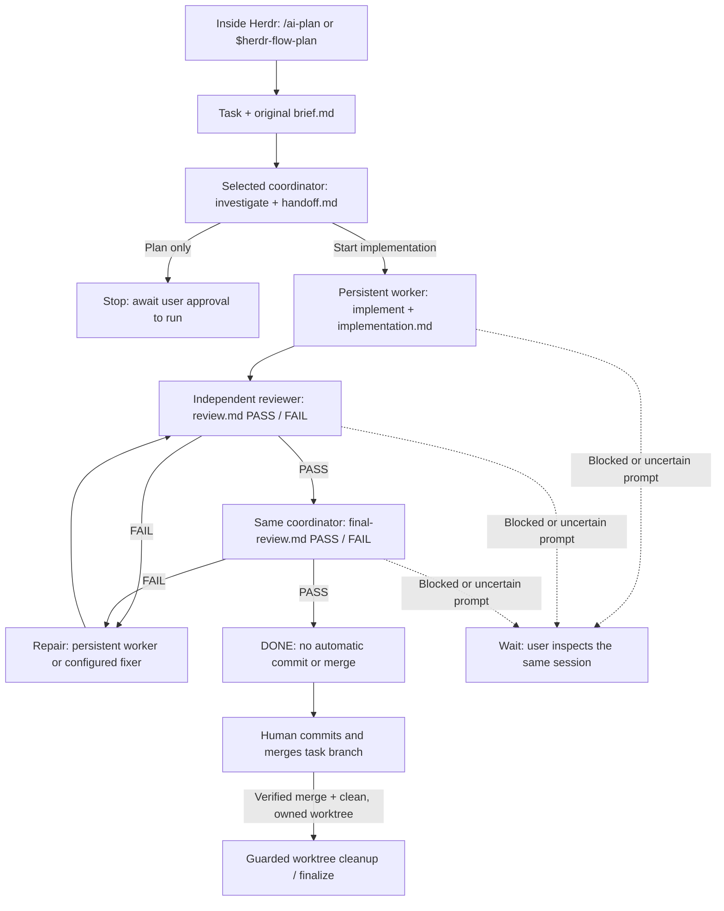

# Herdr Flow

File-backed, persistent multi-agent development workflow for [Herdr](https://herdr.dev). A Claude Code, Codex, or OpenCode coordinator plans a task and performs its final release review. Independent OpenCode/Codex sessions implement, review, and repair in a task-specific Git worktree. **No automatic commit or merge.** Worktree cleanup requires a verified merge, a clean checkout, and ownership checks.

> **Status:** Automated state-machine tests pass; the full live three-harness acceptance scenario in `ACCEPTANCE.md` remains to be performed inside Herdr. Do not assume race-free operation or unattended production readiness from unit tests alone.

## Workflow at a glance



**Example — add OAuth login**

1. From a Herdr-managed Claude or OpenCode pane, enter `/ai-plan Add OAuth login` (Codex: `$herdr-flow-plan Add OAuth login`). The launcher creates one task and saves the request in `brief.md`.
2. The **globally selected coordinator** investigates, asks about unresolved decisions, and writes `handoff.md`. If another harness was selected, it works in its own pane. For a plan-only request, it stops here; otherwise it calls `herdr-flow run` once.
3. A persistent worker implements in the task worktree. An independent reviewer checks the result; FAIL routes findings to the worker or configured fixer, followed by another review.
4. After reviewer PASS, the **original coordinator** performs final review. A final FAIL enters the repair/review loop; PASS moves the task to DONE.
5. **You** commit and merge. Only a verified merge and clean, owned worktree permit guarded cleanup. The branch and task records remain.

A blocked agent stays in its existing pane. An uncertain prompt is **never** automatically resent.

## Requirements

Linux, Python 3.10+ (tested with 3.14), Git, Herdr 0.9.1+, Claude Code, OpenCode, Codex, and `jq`. Model IDs must be available in your installed OpenCode/Codex catalogs. The plugin uses `hessam.herdr-flow` as its stable Herdr identifier; it does not contain credentials.

## Install

Clone into a **standalone repository**, for example:

```bash
git clone https://github.com/mohaphez/herdr-flow.git ~/projects/github/herdr-flow
```

From a **Herdr-managed pane**, run `~/projects/github/herdr-flow/install.sh`. The installer checks ownership, links the local repository as the Herdr plugin, and links CLI, command, and skill entry points; it does not copy plugin source, overwrite another installation, or rewrite existing user-owned files. Never run it from an external terminal to manipulate live Herdr sessions. If another Herdr Flow installation is active, complete/inspect its tasks before explicitly migrating from a Herdr pane; do not change its live ownership or delete its worktrees.

Herdr Flow keeps a **private** runtime config at `~/.config/herdr/plugins/config/hessam.herdr-flow/config.json` (or use `HERDR_FLOW_CONFIG=/absolute/path/to/private-config.json`). The installer creates that file with mode `0600` only when it does not already exist. The tracked `config.json` is a portable template, **not** your credential or model catalog. Set the worker and reviewer to exact models available on your machine before creating tasks; optionally enable an escalation fixer and change the default coordinator. Example (replace model IDs with real catalog IDs):

```json
{
  "agents": {
    "coordinator": {"kind": "claude", "model": null, "variant": null},
    "worker": {"kind": "opencode", "model": "YOUR_PROVIDER/YOUR_WORKER_MODEL", "variant": null},
    "reviewer": {"kind": "opencode", "model": "YOUR_PROVIDER/YOUR_REVIEWER_MODEL", "variant": null}
  },
  "repair": {
    "escalation": {
      "enabled": false,
      "after_failures": 3,
      "agent": {"kind": "codex", "model": null, "variant": null}
    }
  }
}
```

**Edit the copied full config**, not just the partial example above. `herdr-flow doctor` validates model availability and configuration. `herdr-flow defaults` prints the global coordinator selection. No model/API keys are committed or needed in the repository; each harness uses its own configured authentication.

### Migrating from another linked checkout

This install intentionally refuses to replace another registered plugin or command/skill symlink. From within Herdr, first confirm no live task depends on the old installation, retain its task state and worktrees, and explicitly unlink the old plugin. Copy any private config to a private file outside the old checkout, then remove **only symlinks verified to point to the old plugin** before running the standalone installer. A repository clone or external terminal must not silently take over existing panes, sessions, or workspaces.

## Command reference

Run CLI commands that inspect or control live sessions **inside a Herdr-managed pane**; `defaults` and `doctor` are read-only. The `--task` value is the ID returned by `create` (for example `task-001`). Slash commands are entered in the named agent, not in a shell.

| Command | Where / when | What it does |
| --- | --- | --- |
| `/ai-plan <request>` | Claude or OpenCode agent | Create one task, record the original request, and plan with the global coordinator. |
| `$herdr-flow-plan <request>` | Codex agent | Preferred Codex planning skill; `/prompts:ai-plan <request>` is a deprecated compatibility shortcut. |
| `/ai-run <task-id>` / `/prompts:ai-run <task-id>` | Claude/OpenCode / Codex **original coordinator** | Start implementation after a plan-only handoff; a launcher must not claim another session. |
| `herdr-flow defaults` | Shell, read-only | Show the global coordinator kind, model, and variant. |
| `herdr-flow doctor` | Shell, read-only | Validate tools, installed model IDs, and private configuration. |
| `herdr-flow create --title "<title>"` | Herdr pane, manual path | Create a task and empty handoff/brief; add `--plan-only` to leave implementation off. Set `--branch-type refactor` (or another allowed type) to override inference; explicit agent flags override defaults. |
| `herdr-flow start-coordinator --task <id>` | Herdr pane, after filling `brief.md` | Launch the recorded dedicated coordinator once; not needed for an attached, unpinned Claude coordinator. |
| `herdr-flow run --task <id>` | **Recorded coordinator pane only** | Begin automatic worker → reviewer → repair → final-review handoffs after the handoff is ready. |
| `herdr-flow status --task <id>` | Herdr pane | Inspect phase, agent/pane identity, review gates, instruction drift, and attention; add `--json` for structured output. |
| `herdr-flow focus --task <id> --role <role>` | Herdr pane | Focus the existing coordinator, worker, reviewer, or fixer session. |
| `herdr-flow inspect --task <id> --role <role>` | Herdr pane | Read the recorded live agent before considering recovery or a deliberate resend. |
| `herdr-flow resume --task <id>` | Herdr pane, recovery | Reuse existing sessions; recover only genuinely missing worker/reviewer sessions. |
| `herdr-flow advance --task <id>` | Herdr pane, exceptional reconciliation | Reconcile an already-written report without repeating an implementation prompt. |
| `herdr-flow refresh-instructions --task <id> --yes` | Herdr pane, after review, agents idle | Refresh owned worktree instruction snapshots if main-checkout instructions changed. |
| `herdr-flow reconcile-branch --task <id> --branch <name> --yes` | Herdr pane, after an unprovable rename in DONE | Explicitly acknowledge the *already checked-out* task branch after inspecting Git; changes only task metadata, never Git refs. |
| `herdr-flow finalize --task <id>` | Herdr pane, **after human merge** | Remove only a verified merged, clean, owned task worktree; keep branch and task records. |

Agents normally call `herdr-flow finish`, `review-result`, and `final-result` themselves after writing evidence-backed reports. Manual `implement`, `review`, `fix`, and `configure-agent` are available for recovery or pre-session role selection. Never use `resend --yes` before `inspect`, or use any command to bypass a blocked agent.

## Start a task

Inside a Herdr-managed project pane:

- **Claude Code / OpenCode:** `/ai-plan Add OAuth login`
- **Codex:** `$herdr-flow-plan Add OAuth login`; `/prompts:ai-plan` is a deprecated Codex custom-prompt compatibility shortcut (open a new Codex session after installing it).

The launcher creates one task, stores the original safe request in `brief.md`, and consults the **global** default coordinator. When unpinned Claude launches its own task, it may coordinate from that pane. A Codex/OpenCode (or pinned Claude) coordinator is a dedicated model-pinned Herdr session; the launcher does not take over its identity. The coordinator writes `handoff.md` and, unless the task is `--plan-only`, runs `herdr-flow run` **from its own pane**. The controller then routes implementation → independent review → repair if needed → final review back to the same coordinator.

Manual CLI path:

```bash
herdr-flow create --title "Add OAuth login"
$EDITOR .ai/workflow/task-001/brief.md  # Replace the placeholder with a non-secret request.
herdr-flow start-coordinator --task task-001  # From inside Herdr; required for managed coordinators.
herdr-flow status --task task-001
```

You can pin roles on `create` using `--coordinator-kind`, `--coordinator-model`, `--coordinator-variant`, `--worker-*`, `--reviewer-*`, `--fixer-*`, and `--escalation-*`; omit coordinator flags to use the global default. Task selections are frozen in `state.json` and do not change when defaults change. The global config is not overridden by a project's `.ai/workflow/config.json` snapshot. Worker/reviewer/fixer sessions retain their model and identity once launched.

Task state lives in the source checkout under `.ai/workflow/<task-id>/`; the task worktree has an ignored marker and symlink to it. In the source checkout, the plugin snapshots **only** ignored root `AGENTS.md`/`CLAUDE.md` into the worktree when absent; it does not copy `.env`, `.agents/`, `.claude/`, or arbitrary ignored files. `.herdr-flow-context.md` warns agents that commands and Docker/Compose mounts from the main checkout may not work safely in an isolated worktree. Source drift or modified snapshots require inspection and, for changes to the source files, an explicit `herdr-flow refresh-instructions --task <id> --yes` from an idle Herdr task.

### Standard branch names

New tasks use `feat/<slug>`, `fix/<slug>`, `refactor/<slug>`, `docs/<slug>`, `test/<slug>`, or `chore/<slug>` based on keywords in the **task title**. For example, **“Optimize FormBuilder queries and caching”** produces `refactor/optimize-formbuilder-queries-and-caching`. A neutral title defaults to `feat/`. In command-driven planning, choose a meaningful action verb in the title; if inference is wrong, specify `--branch-type <type>` when creating the task. Herdr Flow adds `-task-<id>` only when the short name collides with a local/remote branch or another task record. It never renames an existing branch just because the naming policy changed.

If you rename a task branch in Git after creation, `finalize` accepts the new checked-out name **only** when the original branch no longer exists and Git's reflog proves the exact rename. It records the change in `project.branch_history` after all merge, cleanliness, and ownership checks pass. If proof is missing or ambiguous, it refuses cleanup with an actionable message: inspect the worktree and, from Herdr, run `herdr-flow reconcile-branch --task <id> --branch <actual-checked-out-name> --yes`, then `finalize`. Reconciliation requires a DONE task and matching task ownership marker; it never renames Git refs or overrides a foreign worktree.

### Review, recovery, and cleanup

The independent reviewer must report evidence-backed PASS/FAIL in `review.md`; the coordinator does the same in `final-review.md`. Failures route to the original worker or dedicated fixer. Optional cumulative escalation starts only after the configured number of failures and reuses its own persistent session. Kimi, if chosen as a reviewer model, runs **inside OpenCode**, not Kimi Code CLI.

A blocked session waits for the user. Prompt delivery is fingerprinted and uncertain sends are **never** automatically replayed. Use `herdr-flow status`, `focus`, `inspect`, and `resume` from Herdr; only deliberately `resend --yes` after inspecting an uncertain prompt. Git commit/merge is a human action. After a real merge, `herdr-flow finalize --task <id>` checks branch ancestry, the clean worktree, ignored-file ownership, and idle task agents before non-forced removal of the workspace. The branch and task reports remain. Squash/rebase merges without ancestry cannot be verified automatically.

## Development

```bash
python3 -m unittest discover -s tests -v
python3 -m py_compile src/herdr_flow.py
bash -n install.sh
```

Read `ACCEPTANCE.md` for the **live Herdr-pane** test; unit tests use a fake adapter and do not prove live harness behavior. The design and known concurrency/recovery limitations are described in `COORDINATION-DESIGN.md`.

## License

[MIT](LICENSE) © 2026 Hessam Taghvaei.
